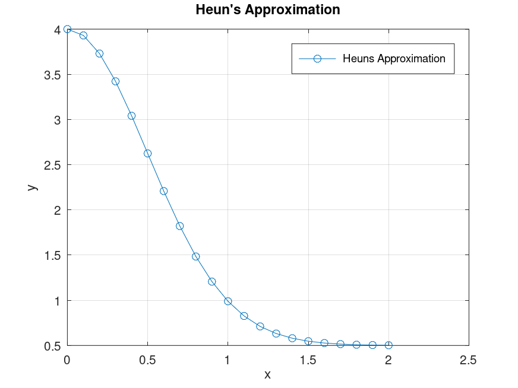
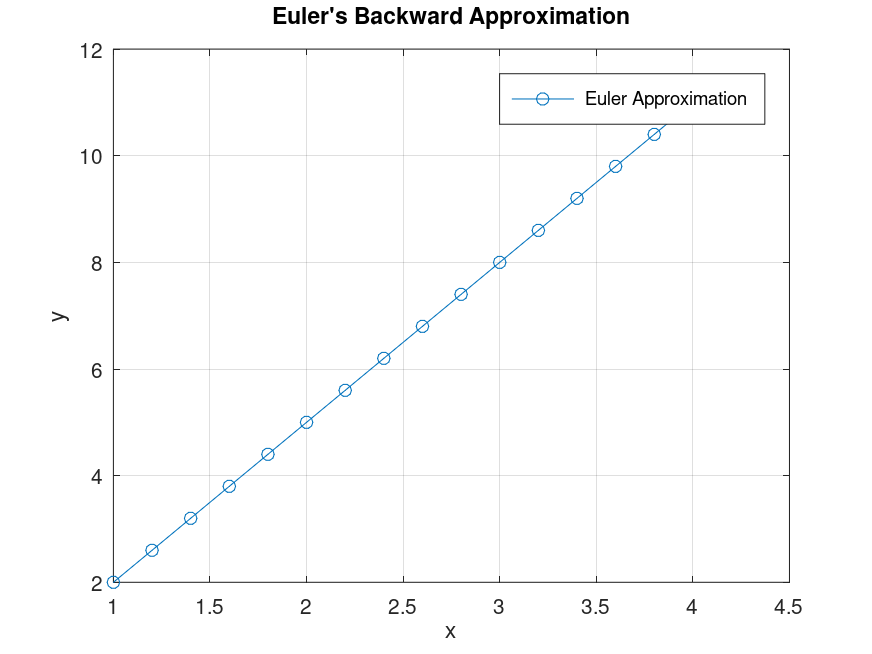

# Math352: Numerical Analysis Course - LAB Content

This repository contains implementations of numerical methods using **Octave**. The goal is to apply and explore fundamental **Numerical Analysis** techniques to solve mathematical problems.

> [!IMPORTANT]
>[GNU Octave](https://www.gnu.org/software/octave/) (Recommended for running the scripts)

## 🚀 Getting Started

1. Clone the repository

   ```bash
   git clone https://github.com/abanoub-refaat/M352-Numerical-Analysis.git
   cd M352-Numerical-Analysis
   ```

2. Open **Octave** and run any script:

   ```octave
   script_name.m
   ```

> [!NOTE]
> replace script_name with the name of the actual script you want.

## 📌 Forward Euler’s Method in Octave

Euler’s method is a simple numerical approach for solving ODEs:

\[
y\_{i+1} = y_i + h f(x_i, y_i)
\]

It approximates the solution by using the slope at the current point.

**Implementing Euler's Forward Method:**

```octave
function [x, y] = eulers_method(f, xinit, xend, yinit, h)
    N = (xend - xinit) / h;
    x = [xinit zeros(1, N)];
    y = [yinit zeros(1, N)];

    for i = 1 : N
        x(i+1) = x(i) + h;
        y(i+1) = y(i) + h * feval(f, x(i), y(i));
    end

    % Plot the solution
    plot(x, y, 'b-s', 'LineWidth', 2);
    xlabel('x');
    ylabel('y');
    title("Euler's Method Numerical Solution");
    grid on;
    legend('Heun's Method', 'Euler's Method');
    hold off;

    % Save the plot
    print -dpng eulers_method_plot.png;
endfunction
```

---

## 📌 Heun's Method in Octave

Heun’s method is an improved **Euler's method**, using a **predictor-corrector** approach:

\[
y*{i+1} = y_i + \frac{h}{2} \left[ f(x_i, y_i) + f(x*{i+1}, y\_{\text{new}}) \right]
\]

Where:

- \( y\_{\text{new}} = y_i + h \cdot f(x_i, y_i) \) (Predictor step)
- \( y\_{i+1} \) is updated using the average slope (Corrector step).

**Implementing Heun's Method:**

```octave
function [x, y] = heuns_method(f, xinit, xend, yinit, h)
    N = (xend - xinit) / h;
    x = [xinit zeros(1, N)];
    y = [yinit zeros(1, N)];

    for i = 1 : N
        x(i+1) = x(i) + h;
        % Predictor step
        ynew = y(i) + h * feval(f, x(i), y(i));
        % Corrector step
        y(i+1) = y(i) + (h/2) * (feval(f, x(i), y(i)) + feval(f, x(i+1), ynew));
    end

    % Plot the solution
    figure;
    plot(x, y, 'r-o', 'LineWidth', 2);
    xlabel('x');
    ylabel('y');
    title("Heun's Method Numerical Solution");
    grid on;
    hold on;

    % Save the plot
    print -dpng heuns_method_plot.png;
endfunction
```

---

## 🛠️ How to Use

1. **Define the function** you want to solve:

   ```octave
   f = @(x, y) x + y;  % Example: dy/dx = x + y
   ```

2. **Run Heun's Method:**

   ```octave
   [x_h, y_h] = heuns_method(f, 0, 2, 1, 0.2);
   ```

3. **Run Euler's Method:**

   ```octave
   [x_e, y_e] = eulers_method(f, 0, 2, 1, 0.2);
   ```

4. **Check the generated plots in `heuns_method_plot.png` and `eulers_method_plot.png`.** 📈

---

## 📊 Comparison of Heun’s and Euler’s Methods

| Method             | Order of Accuracy | Stability   | Error Reduction   |
| ------------------ | ----------------- | ----------- | ----------------- |
| **Euler’s Method** | First-order       | Less stable | More error-prone  |
| **Heun’s Method**  | Second-order      | More stable | Improved accuracy |

- **Euler’s Method** is simpler but less accurate.
- **Heun’s Method** reduces error by using an additional correction step.

---

### 📊 Graph Output

The numerical solutions will be plotted and saved as:




