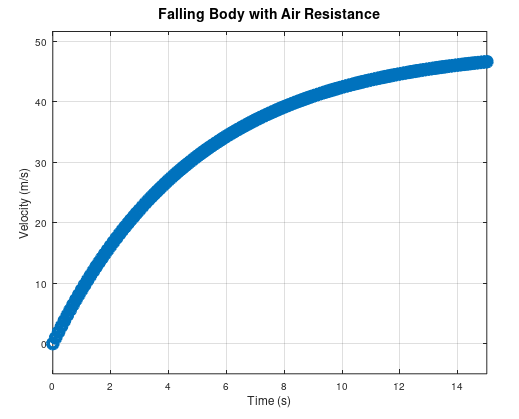

# Falling Body Solver - M352 Final Project

## Overview

The Falling Body Solver is a MATLAB-based interactive GUI application that simulates the motion of objects falling under gravity with air resistance. This tool allows users to explore how parameters such as mass and air resistance affect the velocity profile of falling objects.

> Click on the image to see the full video!

[](https://drive.google.com/file/d/1Z_d1jDxz9k0-nD5XuXuMtBnehEm3z_xF/view?usp=drive_link)

## Features

- User-friendly graphical interface for parameter input
- Numerical simulation using Runge-Kutta 4th order method
- Real-time visualization of velocity vs. time
- Tool to query velocity at any specific time point
- Interactive plotting with customizable range

## Requirements

- MATLAB (Developed and tested on MATLAB R2019b or newer)
- MATLAB's basic toolboxes (no specialized toolboxes required)

## Installation

1. Download all files to a directory of your choice
2. Ensure the `runge_kutta_4.m` function is in the same directory or in MATLAB's path
3. Run the main script by typing `falling_body_gui` in the MATLAB command window

## Usage Instructions

1. Launch the application by running `falling_body_gui` in MATLAB
2. Enter the following parameters in the input fields:
   - Mass (kg): The mass of the falling object
   - Resistance (k): Air resistance coefficient
   - Initial Velocity (v0): Starting velocity (positive for upward, negative for downward)
   - Step size (h): Time increment for numerical calculation
   - Total Time (Tmax): Duration of the simulation
3. Click the "Solve" button to run the simulation
4. A plot showing velocity vs. time will appear
5. In the secondary window, you can enter a specific time value to get the corresponding velocity

## Theory

The simulation is based on the differential equation:

```latex
dv/dt = g - (k/m)*v
```

Where:

- v = velocity (m/s)
- t = time (s)
- g = gravitational acceleration (9.81 m/s²)
- k = resistance coefficient
- m = mass of object (kg)

The equation is solved numerically using the Runge-Kutta 4th order method, which provides high accuracy for this type of differential equation.

## File Descriptions

- `falling_body_gui.m`: Main application file containing the GUI and simulation code
- `runge_kutta_4.m`: Implementation of the Runge-Kutta 4th order numerical method

## Example Parameter Sets

- **Standard falling object**: m = 1, k = 0.2, v0 = 0, h = 0.1, Tmax = 20
- **Light object with high air resistance**: m = 0.1, k = 0.5, v0 = 0, h = 0.1, Tmax = 10
- **Heavy object with minimal air resistance**: m = 10, k = 0.1, v0 = 0, h = 0.1, Tmax = 30

## Notes

- The application assumes the positive direction is upward
- Terminal velocity is reached when the drag force equals the gravitational force

## Team Members

- [Abanoub Refaat Ibrahim - 2227248](https://github.com/abanoub-refaat)
- [Ebram Wael Nabih - 2227393](https://github.com/Ebram-Wael)
